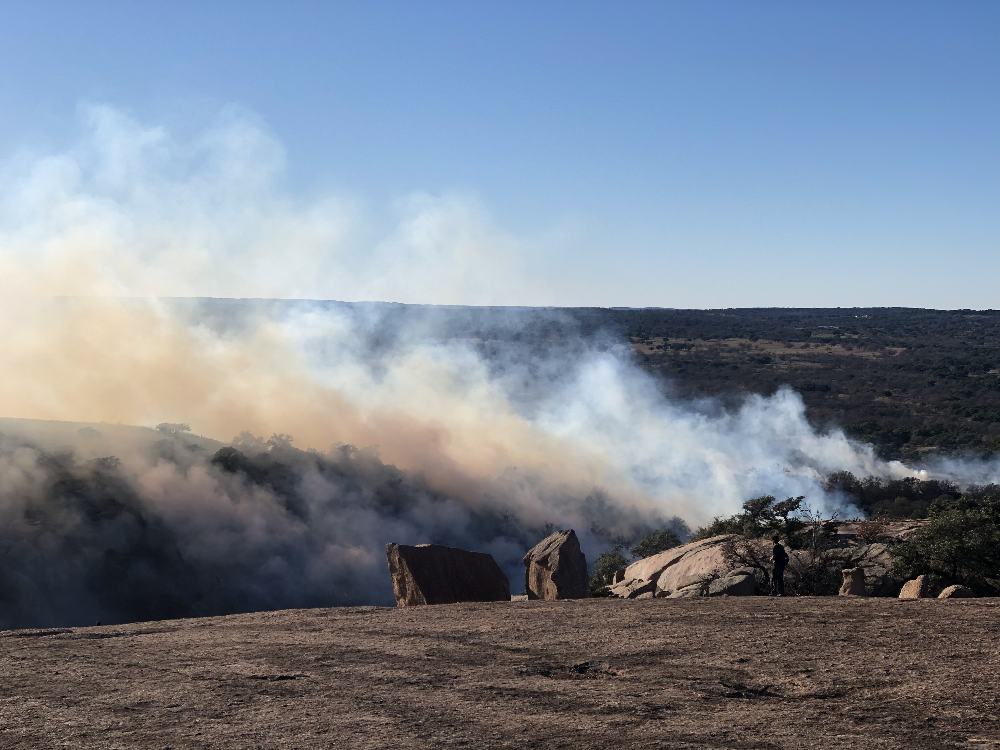

::: {.callout-note style="color: navy;" appearance="simple"}
## TLDR

- Prescribed fires are set by professionals under certain weather conditions that promote containment.

- They reduce the severity of damage and air pollution caused by future wildfires.

- Records of prescribed fires date back to early Indigenous peoples.

- Lack of funding for for institutions and research, along with public distrust, limit the practice, despite the ecological and hazard mitigation benefits.
:::

In December of 2019, two new Austin-transplants ventured into the Texas Hill Country to Enchanted Rock State Natural Area, nearly two hours outside of the Austin city limits. In between hiking, climbing rocks, and snapping pictures of cacti with Texas-shaped cutouts, we caught a glimpse of a small fire arising from the valley below.

The fire had a strange pattern- it expanded in a line across juniper, Bluestem grass, and other ferns and shrubs native to the Edwards Plateau[@TWDB2026]. It slithered along the base of a small hill in the distance. Soon the pale December horizon was filled with light gray smoke, and workers in yellow jackets quietly but intently monitored the blaze.

{width="15cm"}

## Definition

We were witnessing a controlled - or "prescribed" burn, carried out by local authorities. A prescribed burn is a low-intensity fire started by fire professionals in a desired area under specific weather conditions, including:

- Steady, non-shifting wind speed (between 4-15 miles per hour).

- Dry-but not too dry-conditions (between 30 - 65% humidity, depending on fuel size).

- Moist soil (from the surface to a 10-inch depth).

- Cooler temperatures (between 25-80° F)

These conditions are closely monitored to ensure that while vegetation, brush, and trees (otherwise known as "**fuel**[^1]") burns, embers do not catch wind and spread to unintended areas, or otherwise escape the control area [@NRCS2012].

[^1]: Fire managers define fuels as all living and dead plant material that can be ignited by a fire (NPS).



## Historical Roots

Documented fire management in the Southern United States dates back to the 1920's, but indigenous peoples had been performing prescribed burns to improve wildlife habitat and improve visability and mobility. They passed along their techniques to early European settlers [@HaleJohnson2002].

As climate change increases the severity and frequency of wildfires, government and research institutions are looking for new ways to curb these effects [@NASA2026]. And an increasingly popular method is the old fashioned way of *fighting fire with fire*.

Opposition to prescribed burning among the public has persisted about as long as the practice itself [@TFS2021]. While research and funding on fire management increased exponentially from the late 1990's to the early 2020's [@bargali2024] [@FAS2023], situations such as the **Hermit's Peak/Calf Canyon fire**[^2] in New Mexico sow public distrust of the practice as a general trend towards skepticism in public figures trickles down to government agencies and scientists[@Kennedy2023].

[^2]: The Hermit's Peak/Calf Canyon Fire burned 341,471 acres across four counties in Northern New Mexico in 2022 — the largest wildfire in state history — caused by two federally-led prescribed fires that escaped and merged in the Santa Fe National Forest (NMFWRI).

## Benefits

As the following studies show, controlled burns present two primary benefits. They reduce the severity of damage and air pollution from future wildfires that occur on treated land.

```{r setup, include=FALSE}
knitr::opts_chunk$set(
  echo    = FALSE,
  message = FALSE,
  warning = FALSE
)
```

```{r}
library(ggplot2)
library(dplyr)
library(tidyr)
library(scales)
library(ggtext)
library(patchwork)
```

### Okefenokee Case Study: Severity vs. Time Since Last Burn

The 2017 West Mims wildfire in the Okefenokee National Wildlife Refuge crossed both prescribed-fire-treated and untreated land. This panel shows how **mean burn severity (dNBR)**[^3] changed with the number of months elapsed between the last prescribed burn and the wildfire. The study found that prescribed burns were most effective when done within 12-24 months of the wildfire. However, benefits could be found up to five years after a prescribed burn [@ross2024].

[^3]: Provides a measure of burn severity (Ross).

```{r okefenokee-time}
okef_data <- tibble(
  months_since_burn = c(1, 6, 12, 18, 24, 30, 38),
  treated_dNBR      = c(60, 110, 140, 170, 195, 215, 235)
)

area_labels <- c(
  treated_dNBR = "Prescribed-Fire Treated"
)

area_colors <- c(
  "Prescribed-Fire Treated" = "#D95F02"
)

# Convert to long format
okef_long <- okef_data %>%
  pivot_longer(
    cols      = treated_dNBR,
    names_to  = "area",
    values_to = "dNBR"
  ) %>%
  mutate(area = recode(area, !!!area_labels))

p2 <- ggplot(
  okef_long,
  aes(
    x = months_since_burn,
    y = dNBR,
    colour = area
  )
) +
  geom_line(linewidth = 1.3) +
  geom_point(size = 3.5) +

  scale_colour_manual(
    values = area_colors,
    name = NULL
  ) +

  scale_x_continuous(
    breaks = okef_data$months_since_burn,
    labels = \(x) paste(x, "mo")
  ) +

  labs(
    title    = "Mean Burn Severity Over Time Following Prescribed Fire",
    subtitle = "2017 West Mims Wildfire — Okefenokee National Wildlife Refuge",
    x        = "Time Since Last Prescribed Burn",
    y        = "Mean dNBR (burn severity index)",
    caption  = paste(
      "Source: Tall Timbers / MDPI Remote Sensing 16(24):4708 (2024).",
      "Higher dNBR values indicate greater burn severity."
    )
  ) +

  theme_minimal(base_size = 13) +

  theme(
    plot.title       = element_text(
      face = "bold",
      size = 14,
      colour = "grey10"
    ),
    plot.subtitle    = element_text(
      colour = "grey40",
      size = 11,
      margin = margin(b = 10)
    ),
    plot.caption     = element_text(
      colour = "grey55",
      size = 8.5,
      hjust = 0
    ),
    legend.position  = "none",
    panel.grid.minor = element_blank(),
    plot.margin      = margin(12, 20, 12, 12)
  )

p2
```

### California 2020: Smoke (PM2.5) Emissions

The Stanford study [@kelp2025] found that prescribed burns emit only **\~17%** of the **PM2.5**[^4] smoke that a wildfire would produce over the same landscape. It also found that prescribed burns outside of the **wildland-urban interface (WUI)**[^5] were more effective in reducing burn severity and PM2.5 smoke than those within it. This panel compares smoke pollution outcomes for California's 2020 fire season.

[^4]: Particulate matter emissions (Kelp).

[^5]: The WUI is the area where human development (such as homes) meets wildland vegetation (Kelp).

```{r}
smoke_data <- tibble(
  scenario = c(
    "Wildfire in\nUntreated Area",
    "Wildfire in\nPrescribed-Burn Treated Area",
    "Prescribed Burn\nItself"
  ),
  pm25_index = c(100, 86, 17)   # untreated wildfire baseline = 100
)

smoke_colors <- c(
  "Wildfire in\nUntreated Area"                = "#B22222",
  "Wildfire in\nPrescribed-Burn Treated Area" = "#E69F00",
  "Prescribed Burn\nItself"                   = "#009E73"
)

p3 <- ggplot(
  smoke_data,
  aes(
    x = reorder(scenario, -pm25_index),
    y = pm25_index,
    fill = scenario
  )
) +
  geom_col(width = 0.55) +

  geom_text(
    aes(label = paste0(pm25_index, "%")),
    vjust    = -0.5,
    fontface = "bold",
    size     = 5.5,
    colour   = "grey15"
  ) +

  scale_fill_manual(
    values = smoke_colors,
    guide = "none"
  ) +

  scale_y_continuous(
    limits = c(0, 115),
    expand = expansion(mult = c(0, 0))
  ) +

  labs(
    title    = "Relative PM2.5 Emissions Across Fire Scenarios",
    subtitle = paste(
      "Relative smoke emissions during California's 2020 fire season",
      "\n(Untreated wildfire = 100% baseline)"
    ),
    x        = NULL,
    y        = "PM2.5 Emissions (% of untreated wildfire)",
    caption  = paste(
      "Source: Kelp et al. (2025), AGU Advances.",
      "Values represent relative PM2.5 emissions estimated for",
      "California's 2020 fire season."
    )
  ) +

  theme_minimal(base_size = 13) +

  theme(
    plot.title = element_text(
      face = "bold",
      size = 14,
      colour = "grey10"
    ),

    plot.subtitle = element_text(
      colour = "grey40",
      size = 10.5,
      margin = margin(b = 10)
    ),

    plot.caption = element_text(
      colour = "grey55",
      size = 8.5,
      hjust = 0
    ),

    panel.grid.major.x = element_blank(),
    panel.grid.minor   = element_blank(),

    axis.text.x = element_text(
      size = 10.5,
      colour = "grey20"
    ),

    axis.text.y = element_text(
      colour = "grey40"
    ),

    plot.margin = margin(12, 20, 12, 12)
  )

p3
```

## Conclusion

Standing on the granite dome at Enchanted Rock, watching the smoke curl up from the valley, it was hard not to fear the worst and run for the car. The calmness by which the experts observed the fire gave me pause. I realized I was watching a practice so ancient, we have no idea when and where it really began. But we do know it's been part of the Texas ecosystem for decades, if not centuries.

Prescribed burns work. They reduce the fuel loads that turn a bad wildfire into a catastrophic one. But science is only part of the recipe. Public trust, political will, and funding for research and development are all parts of the puzzle.

::: {.callout-tip style="color: navy;" appearance="minimal"}
## Learn More!

*Grants, training, and other resources on prescribed fires:*

- <https://tfsweb.tamu.edu/forest-land/prescribed-fire/>

*Protect your home from wildfire:*

- <https://www.nfpa.org/education-and-research/wildfire/preparing-homes-for-wildfire>

*Texas Wildfire Risk Assessment Portal*

- <https://texaswildfirerisk.com/>
:::

::: {.callout-tip style="color: navy;" appearance="minimal"}
## Read Next

*Prescribed Fire Benefits:*

- <https://tfsweb.tamu.edu/forest-land/prescribed-fire/prescribed-fire-benefits/>

*Using Fire to Benefit Habitat, Wildfire, and People:*

- <https://www.fws.gov/story/2025-05/using-fire-benefit-habitat-wildlife-and-people>

*The Ecological Benefits of Fire:*

- <https://education.nationalgeographic.org/resource/ecological-benefits-fire/>
:::

## References

::: {#refs}
:::
